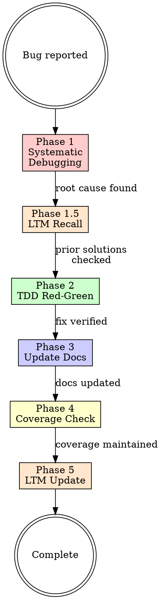

# Bug Solver

## Overview

End-to-end bug resolution process: find root cause, write failing test, fix, verify, update documentation, check coverage.

**Core principle:** No fix without root cause. No fix without a failing test first. No completion without documentation and coverage updates.

## When to Use

**Trigger on:**
- Error messages or screenshots showing failures
- "This doesn't work", "I see a bug", "something is wrong"
- Unexpected behavior reports ("it shows X instead of Y")
- UI elements not responding or showing wrong data
- Operations that fail silently or with errors
- "When I click/press/do X, Y happens instead of Z"

**Do NOT trigger on:**
- "Add a feature", "implement X", "create a new page"
- Architecture or design discussions
- Refactoring requests without a reported defect
- General questions about how the code works

## The Process

### Phase 1: Systematic Debugging

**REQUIRED SUB-SKILL:** Use superpowers:systematic-debugging

Follow all four phases of the systematic debugging skill:
1. **Root cause investigation** — read errors carefully, reproduce, trace data flow
2. **Pattern analysis** — find working examples, compare
3. **Hypothesis** — form single theory, test minimally
4. **Do NOT propose fixes until root cause is confirmed**

If unsure between multiple plausible root causes, **consult the user** before proceeding. The user is an expert and can help narrow down.

### Phase 1.5: LTM Recall

Once the root cause is identified, search long-term memory for prior solutions:

1. Use `mcp__ltm__recall` to search for keywords related to the root cause (error type, component name, pattern name).
2. If a relevant memory is found, check if the prior solution applies to the current bug. If it does, use it to inform the fix — don't reinvent.
3. If no relevant memory exists, proceed normally.

This step prevents re-solving problems that were already solved in previous sessions.

### Phase 2: TDD Red-Green

**REQUIRED SUB-SKILL:** Use superpowers:test-driven-development

Once root cause is confirmed:

1. **RED** — Write a test that reproduces the bug. Run it. Watch it fail. The failure must match the reported bug (not a typo or setup error).
2. **GREEN** — Write the minimal fix. Run the test. Watch it pass.
3. **Verify** — Run the full test suite. No regressions.

### Phase 3: Update Documentation

After the fix is verified, update test documentation:

1. **Detailed test plan** (`docs/test-plan-detailed.md`) — add new test case IDs to the appropriate section. Update test count in exit criteria.
2. **High-level test plan** (`docs/test-plan.md`) — update coverage matrix if a new test area was added. Add new cross-cutting strategy section if the fix covers a new concern.
3. **Only update if the fix added new test cases or changed test scope.** Simple fixes that don't add tests don't need doc updates.

### Phase 4: Coverage Check

Run coverage tests and verify the new code is covered:

1. **Backend:** `go test ./internal/... -count=1 -coverprofile=coverage.out`
2. **UI browser:** `npx vitest run --config vitest.browser.config.ts --coverage`
3. **UI system:** `npx vitest run --config vitest.system.config.ts` (if fix is deployed)
4. Check that new code has coverage. If not, add tests until it does.
5. **Update coverage report** (`docs/coverage-report.md`) with new numbers.

### Phase 5: LTM Update

After the bug is resolved, evaluate whether to store the solution in long-term memory:

**Store to LTM when:**
- The root cause was non-obvious or took significant investigation
- The fix involved a pattern or workaround that would be useful in future sessions
- The bug was in a component/library where similar issues may recur (e.g., PF topology, GORM migration)

**Do NOT store when:**
- The fix was trivial (typo, missing import, wrong variable name)
- The root cause was immediately obvious from the error message
- The solution is already documented in project docs or existing LTM memories

**How to store:**
1. Use `mcp__ltm__recall` to check if a related memory already exists — update it rather than creating a duplicate.
2. Use `mcp__ltm__store_memory` with a descriptive topic, the root cause, the fix, and key lessons. Set `difficulty` based on investigation effort (0.3 for moderate, 0.7+ for hard bugs).
3. Tag with relevant component/library names for future searchability.
4. Notify the user: "Stored this solution to LTM for future reference."

## Red Flags

| Thought | Reality |
|---------|---------|
| "I see the fix, let me just do it" | Find root cause first. Phase 1 is mandatory. |
| "The test is obvious, skip RED" | You must watch the test fail to prove it tests the right thing. |
| "Docs don't need updating" | If you added test cases, update the test plan. |
| "Coverage is fine, skip the check" | Run it. New code without coverage is technical debt. |
| "It's a simple one-line fix" | Simple fixes still need root cause analysis and a test. |
| "I don't need to check LTM" | You might have solved this exact problem before. 10 seconds to search saves 30 minutes. |
| "This isn't worth storing to LTM" | If you spent more than 15 minutes debugging, future you will thank you. |

## Consulting the User

**STOP and ask the user when:**
- Multiple plausible root causes exist
- The fix requires choosing between two or more reasonable approaches
- You're unsure if the behavior is actually a bug or intended
- The fix would change existing behavior beyond the reported issue
- You've tried 2+ fixes without success

The user is an expert developer. Never take a decision between options without consulting them.
