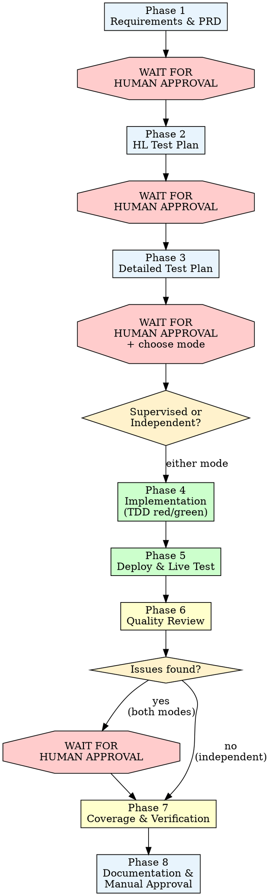

# Feature Plan — Phased Feature Development

## Overview

Eight-phase feature development with mandatory human approval gates for planning phases, then a choice of supervised or independent execution for implementation phases.

**Core principle:** No implementation without approved requirements and test plans. No completion without 100% test pass rate and justified coverage. Phases 1-3 always require explicit human approval. Phases 4-8 run in the mode chosen by the human.

**Violating the approval gates is violating the spirit of this process.**

## When to Use

**Trigger on:**
- "Implement this feature", "Add this capability"
- "Follow this plan", "Execute this user story"
- Feature requests that span backend + API + UI
- PRD-driven development tasks
- Multi-layer changes requiring coordinated test plans

**Do NOT trigger on:**
- Bug fixes (use bug-solver)
- Pure refactoring without new behavior
- Documentation-only updates
- Single-file trivial changes

## The Process

---

## Execution Mode Selection

**After Phase 3 approval, ask the human to choose an execution mode using AskUserQuestion:**

### Supervised Mode
- Human confirms each phase transition (4→5→6→7→8)
- Present results and wait for explicit "proceed" after every phase
- Quality review findings always presented for decision

### Independent Mode
- Phases 4 through 8 run without stopping for approval
- **Exception 1:** If the quality review (Phase 6) finds issues, you MUST stop and present findings. Wait for human decision on what to fix before continuing.
- **Exception 2:** If no quality review issues, the next approval gate is at the end of Phase 8 (final manual approval).

**The mode choice does NOT affect Phases 1-3. Those always require approval.**

**Rationalizations that mean STOP:**

| Excuse | Reality |
|--------|---------|
| "Independent mode means skip quality review" | No. Independent mode means skip approval gates IF no issues. Quality review always runs. |
| "The issues are minor, I'll skip the approval" | Any issue found = mandatory approval gate. The human decides what's minor. |
| "I'll fix the issues and continue without asking" | In independent mode, issues = stop. Present findings. Wait. |

---

## Phase 1: Requirements & Architecture

**Goal:** Analyze requirements. Update PRD and architecture documents if needed.

**Actions:**
1. Read and understand the feature request or plan
2. Search LTM (`mcp__ltm__recall`) for prior decisions, patterns, or lessons related to this feature area — incorporate relevant findings into the approach
3. Read existing PRD, architecture docs, and relevant codebase
4. Identify which user stories and acceptance criteria are affected
5. Update PRD with new or modified acceptance criteria
6. Document any architecture decisions needed
7. Present changes to the human partner

**Exit criteria:** PRD and architecture docs updated with clear acceptance criteria.

**MANDATORY: Present changes and WAIT for explicit human approval before proceeding to Phase 2. Do NOT bundle Phase 2 work into this step.**

---

## Phase 2: High-Level Test Plan

**Goal:** Update the high-level test plan with new test areas and strategy.

**Actions:**
1. Read existing `docs/test-plan.md`
2. Add new feature area rows to the coverage matrix
3. Add a new test strategy section describing:
   - What is tested at each layer (unit, integration, API, UI)
   - Key behaviors to verify
4. Present changes to the human partner

**Exit criteria:** Test plan coverage matrix and strategy section updated.

**MANDATORY: Present changes and WAIT for explicit human approval before proceeding to Phase 3. Do NOT proceed without approval.**

---

## Phase 3: Detailed Test Plan

**Goal:** Update the detailed test plan with specific test case IDs and expected outcomes.

**Actions:**
1. Read existing `docs/test-plan-detailed.md`
2. Add new test cases with IDs following the existing numbering convention
3. Each test case must have: ID, description, layer (Unit/API/Browser/System), expected outcome
4. Update Phase A exit criteria test count
5. Present the test table to the human partner

**Exit criteria:** All new test cases documented with IDs, layers, and expected outcomes.

**MANDATORY: Present changes and WAIT for explicit human approval. Then ask the human to choose execution mode (Supervised or Independent) before proceeding to Phase 4.**

---

## Phase 4: Implementation (TDD Red/Green)

**Goal:** Implement bottom-up using strict TDD methodology.

**REQUIRED:** Follow superpowers:test-driven-development strictly.

**Approach:**
- **Bottom-up order:** service layer → handler/DTO → API client → UI
- **Baby steps:** One test at a time, one behavior at a time
- **For each unit of work:**
  1. **RED:** Write the failing test first. Run it. Confirm it fails for the right reason.
  2. **GREEN:** Write minimal code to make the test pass. Run it. Confirm it passes.
  3. **Verify:** Run all existing tests to confirm no regressions.

**Red flags — STOP if you catch yourself doing any of these:**
- Writing implementation code before the test
- Writing multiple tests before implementing any
- Skipping the RED verification step
- Not running existing tests after each GREEN step

**Exit criteria:** ALL tests pass (100%). Zero failures across all test suites (backend, browser, system).

**Supervised mode:** Present results and wait for approval before Phase 5.
**Independent mode:** Proceed directly to Phase 5.

---

## Phase 5: Deploy & Live System Test

**Goal:** Deploy to kind cluster and verify against the live system.

**Actions:**
1. Rebuild container images and redeploy: `./scripts/kind-deploy.sh rebuild "kubectl --context kind-assethub"`
2. Wait for all pods to be Running and health checks to pass
3. Test new endpoints against the live API (curl)
4. Verify UI serves correctly
5. Look for bugs that only surface with real data (e.g., duplicates from multi-version associations)
6. If bugs found: write a failing test (TDD RED), fix (GREEN), redeploy, retest

**Exit criteria:** All new functionality works against the deployed system with real data. Any bugs found during live testing are fixed with regression tests.

**Supervised mode:** Present results and wait for approval before Phase 6.
**Independent mode:** Proceed directly to Phase 6.

---

## Phase 6: Quality Review

**Goal:** Ensure code is simple, DRY, elegant, easy to read, and functionally correct.

**Actions:**
1. Launch 3 code-reviewer agents in parallel with different focuses:
   - **Simplicity/DRY/Elegance:** Is the code clean? Any duplication? Could anything be simpler?
   - **Bugs/Functional correctness:** Are there edge cases missed? Race conditions? Error handling gaps?
   - **Project conventions/Abstractions:** Does it follow existing patterns? Are abstractions appropriate?
2. Consolidate findings and identify highest severity issues

**If issues found (either mode):**

3. **MANDATORY: Present findings to the human partner and ask what they want to do** (fix now, fix later, or proceed as-is)
4. Address issues based on human decision
5. **MANDATORY: Use superpowers:test-driven-development for every fix.** Write a failing test that exposes the issue FIRST, verify RED, then fix, verify GREEN. Do NOT write the fix before the test — this is not optional, even for "obvious" one-line fixes. The quality review identified the issue; the test proves it exists and proves the fix works.

**If no issues found:**
- **Supervised mode:** Present clean result and wait for approval before Phase 7.
- **Independent mode:** Proceed directly to Phase 7.

---

## Phase 7: Coverage & Final Verification

**Goal:** Verify 100% test pass rate and maximize code coverage.

**Actions:**
1. Run ALL backend tests: `go test ./internal/... -count=1`
2. Run ALL browser tests: `npx vitest run --config vitest.browser.config.ts`
3. Run ALL system tests: `npx vitest run src/App.system.test.ts`
4. Confirm 100% pass rate across all suites
5. Run coverage for all new/modified code:
   - Backend: `go test -coverprofile=cover.out ./path/to/package/...` then `go tool cover -func=cover.out`
   - UI: `npx vitest run --coverage`
6. For each new function/method, verify coverage percentage
7. For each uncovered line:
   - If coverable: write a test to cover it
   - If not coverable: document the justification (e.g., "error path requires real K8s cluster")
8. Re-run tests after adding coverage tests to confirm no regressions

**Exit criteria:** 100% test pass rate. Every uncovered line in new code has either a test or a documented justification.

**Supervised mode:** Present results and wait for approval before Phase 8.
**Independent mode:** Proceed directly to Phase 8.

---

## Phase 8: Documentation & Manual Approval

**Goal:** Document what was done and get final human approval.

**Actions:**
1. Summarize what was built:
   - Features implemented
   - Files modified (with purpose)
   - Test cases added (with IDs)
   - Bugs found and fixed during deployment
   - Coverage numbers for new code
2. Update project documentation if needed:
   - `docs/coverage-report.md` with new coverage data
   - Any other docs referenced by the changes
3. Update LTM to reflect the new feature:
   - Use `mcp__ltm__recall` to check for existing related memories — update rather than duplicate
   - Use `mcp__ltm__store_memory` to store key architectural decisions, implementation patterns, bug workarounds, or library-specific lessons learned during the feature
   - Use `mcp__ltm__forget` to remove any memories that are now outdated or incorrect due to the new feature (e.g., a memory saying "associations don't have names" after adding association names)
   - Only store what would help a future session working on the same area — not session-specific details
   - Notify the user when a memory is stored or removed
4. Present summary to human partner
5. Wait for manual testing and final approval

**Exit criteria:** Human partner has reviewed the summary, performed any manual testing they want, and given explicit approval.

**Both modes:** This phase ALWAYS requires human approval. It is the final gate.

---

## Approval Gate Rules

These are non-negotiable regardless of execution mode:

| Gate | When | Mode |
|------|------|------|
| After Phase 1 | Before writing test plans | Both |
| After Phase 2 | Before detailed test cases | Both |
| After Phase 3 | Before implementation + mode selection | Both |
| After Phase 6 (if issues) | Before fixing quality issues | Both |
| After Phase 8 | Final approval | Both |

Additional gates in supervised mode only:

| Gate | When |
|------|------|
| After Phase 4 | Before deployment |
| After Phase 5 | Before quality review |
| After Phase 6 (no issues) | Before coverage verification |
| After Phase 7 | Before documentation |

**Rationalizations that mean STOP:**

| Excuse | Reality |
|--------|---------|
| "Phases 1-3 are simple, I'll batch them" | Each phase builds on approval of the previous. Batch = no feedback. |
| "The plan is clear, no need to wait" | Clear to you ≠ approved by human. Wait. |
| "I'll show all 3 phases at once for efficiency" | The human may want changes to Phase 1 that affect Phase 2. Sequential. |
| "It's just docs, I can fix later" | PRD and test plans are contracts. Fix before, not after. |
| "The human will probably approve" | Probably ≠ explicitly. Wait for the words. |
| "Independent mode means skip quality review" | No. Quality review always runs. Mode only affects approval gates. |
| "The issues are minor, I'll skip the approval" | Any issue found = mandatory approval gate. The human decides what's minor. |
| "I'll fix the issues and continue without asking" | Issues = stop and present. In both modes. |
| "This fix is trivial, I'll just change the code" | No. TDD for every fix. Write the failing test first, even for one-line changes. |

## Quick Reference

| Phase | Layer | Supervised | Independent | Exit Criteria |
|-------|-------|-----------|-------------|---------------|
| 1 | Docs | APPROVAL | APPROVAL | PRD updated |
| 2 | Docs | APPROVAL | APPROVAL | HL test plan updated |
| 3 | Docs | APPROVAL + mode | APPROVAL + mode | Detailed test plan updated |
| 4 | Code | APPROVAL | continue | 100% tests pass |
| 5 | Deploy | APPROVAL | continue | Live system verified |
| 6 | Review | APPROVAL | APPROVAL if issues, else continue | Issues addressed |
| 7 | Tests | APPROVAL | continue | 100% pass + coverage justified |
| 8 | Docs | APPROVAL | APPROVAL | Human approved |
